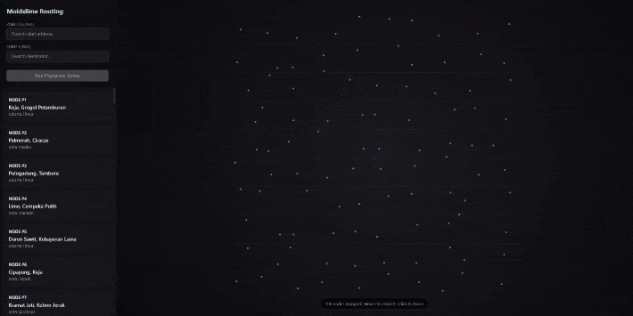

# Moldslime: Intelligent Pathfinding System
<p>
   
</p>
A dynamic mapping and route-finding platform inspired by the growth patterns of *Physarum polycephalum* (slime mould). Moldslime combines a Node.js backend for API orchestration with Python (NetworkX) for heavy graph computation, simulating the fastest path search across 100 organically connected coordinate nodes.

---

## Overview

*Physarum polycephalum* is a single-celled organism renowned for its ability to solve complex network optimization problems through decentralized growth. Moldslime adapts this biological behavior into a software system: nodes are distributed using Simplex Noise to replicate organic spatial patterns, and Dijkstra's algorithm—executed via NetworkX—computes the optimal route between any two points in the network.

---

## Features

- **Interactive Map Canvas** — Real-time visualization with animated path traversal, rendering each discovered route progressively across the node graph.
- **Dual-Engine Architecture** — Node.js handles HTTP routing and API orchestration; Python performs all graph computation through NetworkX.
- **Organic Node Generation** — Simplex Noise drives coordinate generation, producing naturalistic address distributions rather than uniform grids.
- **Path Search Animation** — Visual simulation of slime mould foraging behavior, exploring candidate routes before converging on the shortest path.
- **Dijkstra Pathfinding** — Accurate shortest-path computation via the NetworkX implementation of Dijkstra's algorithm.

---

## System Requirements

- Node.js 18 or higher
- Python 3.8 or higher
- npm (bundled with Node.js)

---

## Installation

### 1. Install Node.js Dependencies

Navigate to the `src` directory and install the required packages:

```bash
cd src
npm install
```

### 2. Install Python Dependencies

Install the required Python libraries:

```bash
pip install -r requirements.txt
```

---

## Usage

### Generate Address Data

To generate or regenerate 100 node coordinates using the Simplex Noise algorithm:

```bash
npm run generate
```

The output is saved automatically to `src/data/address.json`.

### Start the Server

```bash
npm start
```

Once running, open a browser and navigate to `http://localhost:3000`.

---

## Project Structure

```
Moldslime/
├── src/
│   ├── data/           # Stores generated address.json
│   ├── public/         # Frontend assets (HTML, CSS, JavaScript)
│   ├── scripts/        # Core engines: Simplex Noise generator (JS) and Dijkstra pathfinder (Python)
│   └── index.js        # Express server entry point
└── README.md
```

---

## Technical Background

The pathfinding pipeline operates as follows:

1. The frontend sends a source and destination node ID to the Express API.
2. Node.js forwards the request to the Python pathfinding script as a subprocess.
3. The Python script loads the graph from `address.json`, constructs a weighted NetworkX graph, and executes Dijkstra's algorithm.
4. The resulting path is returned as a JSON array and rendered on the canvas with a traversal animation.

Edge weights are computed as the Euclidean distance between adjacent nodes, ensuring the shortest path reflects real spatial distance.

---

## References

- [MoeBuTa/SlimeMould](https://github.com/MoeBuTa/SlimeMould/tree/master) — Original slime mould simulation reference implementation.
- Tero, A. et al. (2010). *Rules for Biologically Inspired Adaptive Network Design*. Science, 327(5964), 439–442.
